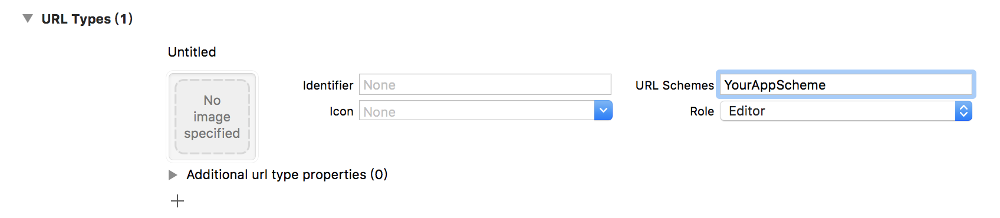

#NebPay
NebPay is an official iOS SDK of NAS nano App, provides several APIs to pay with NAS/NRC20, authenticate, even deploy a smart contract.

#Installation

###CocoaPods
```pod 'NebPay'```

###Carthage
```github "nebulasio/neb.iOS"```

###Manually
1. Clone this repo. 
2. Drag ```NebPay.framework``` to your project.
3. Done!

#Usage

###Import
```@import NebPay;```
###Configuration
Firstly, If you don't have any URL Scheme for your app, you should add one like this:


then, in your appDelegate.m
```objective-c
- (BOOL)application:(UIApplication *)application didFinishLaunchingWithOptions:(NSDictionary *)launchOptions {
    //Config SDK
    [NASSmartContracts setupWithAppName:YourAppName icon:YourAppIcon scheme:YourAppScheme];
    //Uncomment the next line if you want to test your app in NAS TESTNET
    //[NASSmartContracts debugMode:YES];
    return YES;
}
```
and，
```objective-c
//before iOS 9
- (BOOL)application:(UIApplication *)application openURL:(NSURL *)url sourceApplication:(NSString *)sourceApplication annotation:(id)annotation {
    if ([NASSmartContracts handleURL:url]) {
        return YES;
    }
    return YES;
}

//after iOS 9
- (BOOL)application:(UIApplication *)app openURL:(NSURL *)url options:(NSDictionary<UIApplicationOpenURLOptionsKey,id> *)options {
    if ([NASSmartContracts handleURL:url]) {
        return YES;
    }
    return YES;
}
```
That is all the preparation work.

#API

###1. Pay(NAS)
Firstly, create a serial number
```objective-c
self.sn = [NASSmartContracts randomSerialNumber];
```
then
```objective-c
NSError *error = [NASSmartContracts payNas:@(1)
                                 toAddress:to
                                  gasLimit:nil
                                  gasPrice:nil
                              serialNumber:self.sn
                                 goodsName:@"test1"
                               description:@"desc1"
                               callbackURL:nil
                                  complete:^(BOOL success, NSString *txHash, NSString *message) {
                                           if (success) {
                                               NSLog(@"Succeed! txHash:\n%@", txHash);
                                           } else {
                                               NSLog(@"Failed, error: %@", message ?: @"unknown error");
                                           }
                                 }];
```
If user didn't install NAS nano, this method will return a NSError instance. It's better to check this situation by ```[NASSmartContracts nasNanoInstalled]``` before sending the request.

If you provide a custom callbackURL, a post method request will be send to it when the payment is done, whose body is like: 
```
{"payId": SerailNumberOfThePayment, "txHash": HashOfTheTransaction }
```
If you don't provide a custom callbackURL, SDK will use its default callbackURL, then you can query the payment status like this:
```objective-c
[NASSmartContracts checkStatusWithSerialNumber:self.sn
                         withCompletionHandler:^(NSDictionary *data) {
                                 NSData *json = [NSJSONSerialization dataWithJSONObject:data options:NSJSONWritingPrettyPrinted error:nil];
                                 NSString *string = [[NSString alloc] initWithData:json encoding:NSUTF8StringEncoding];
                                 NSLog(@"data: %@", string);
                             } errorHandler:^(NSInteger code, NSString *msg) {
                                 NSLog(@"error: %@", msg);
                             }];
```

###2. Pay(NRC20)
Just like NAS
```objective-c
[NASSmartContracts payNRC20:@(1)
                  toAddress:to
                   gasLimit:nil
                   gasPrice:nil
               serialNumber:self.sn
                  goodsName:@"test2"
                description:@"des2"
                callbackURL:nil
                   complete:^(BOOL success, NSString *txHash, NSString *message) {
                            if (success) {
                                NSLog(@"Succeed! txHash:\n%@", txHash);
                            } else {
                                NSLog(@"Failed, error: %@", message ?: @"unknown error");
                            }
                      }];
```

###3. Call custom function
```objective-c
[NASSmartContracts callMethod:method
                     withArgs:argsArray
                       payNas:@(1)
                    toAddress:to
                     gasLimit:nil
                     gasPrice:nil
                 serialNumber:self.sn
                    goodsName:@"test3"
                  description:@"desc3"
                  callbackURL:nil
                     complete:^(BOOL success, NSString *txHash, NSString *message) {
                              if (success) {
                                  NSLog(@"Succeed! txHash:\n%@", txHash);
                              } else {
                                  NSLog(@"Failed, error: %@", message ?: @"unknown error");
                              }
                        }];
```
###4. Deploy a contract
```objective-c
[NASSmartContracts deployContractWithSource:source
                                 sourceType:sourceType
                                     binary:nil
                                   gasLimit:nil
                                   gasPrice:nil
                               serialNumber:self.sn
                                callbackURL:nil 
                                   complete:^(BOOL success, NSString *txHash, NSString *message) {
                                            if (success) {
                                                NSLog(@"Succeed! txHash:\n%@", txHash);
                                            } else {
                                                NSLog(@"Failed, error: %@", message ?: @"unknown error");
                                            }
                                     }];
```
###5. Wallet authentication
```objective-c
[NASSmartContracts authWithInfo:nil
                       complete:^(BOOL success, NSString *walletAddress, NSString *message) {
                                if (success) {
                                    NSLog(@"Succeed! Wallet address:\n%@", walletAddress);
                                } else {
                                    NSLog(@"Failed, error: %@", message ?: @"unknown error");
                                }
                         }];
```
